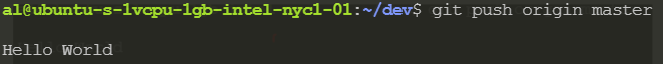
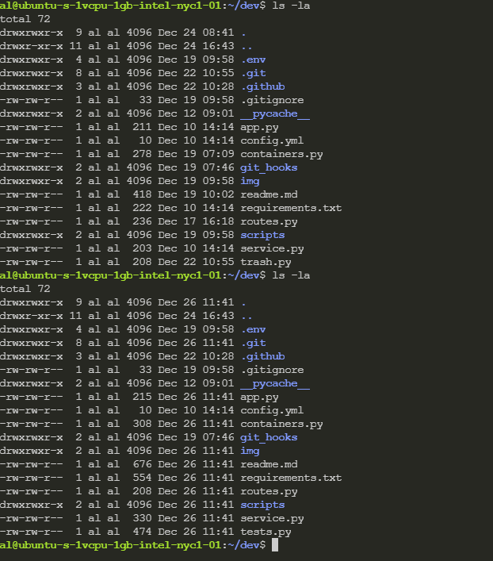
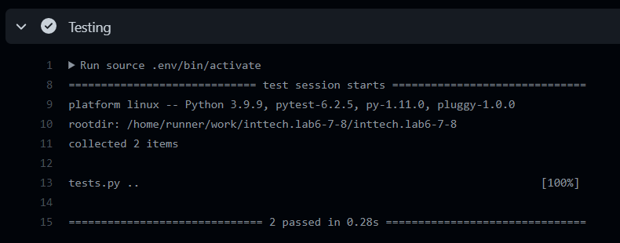
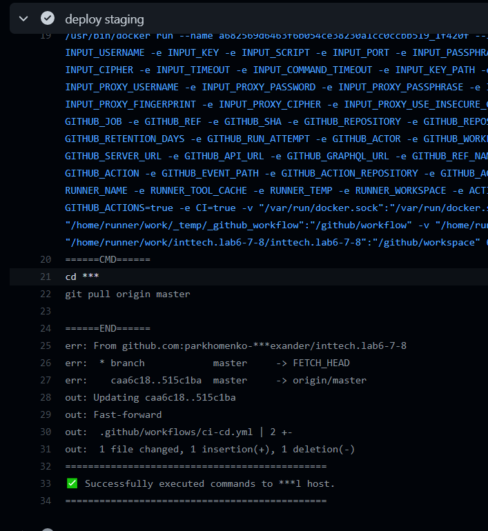
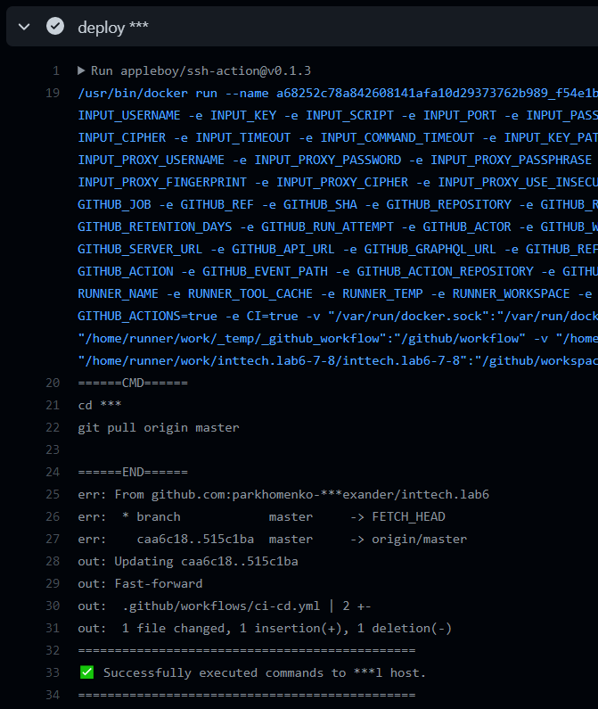

# Лабораторная 6

# Лабораторная 8
До форматирования (до коммита)

После коммита

Однако, неправильный вид коммита не позволяет толкнуть его в репозиторий

Соответствующий - даёт

Серверный хук

# Лабораторная 8
Линтер

Тесты

Деплой staging

До после

Деплой prod

До после

